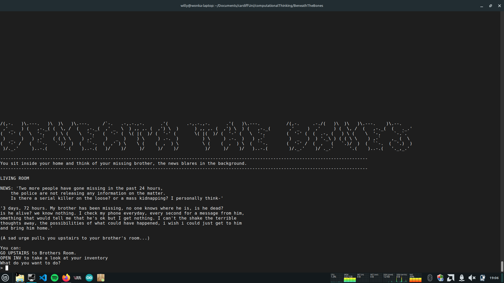
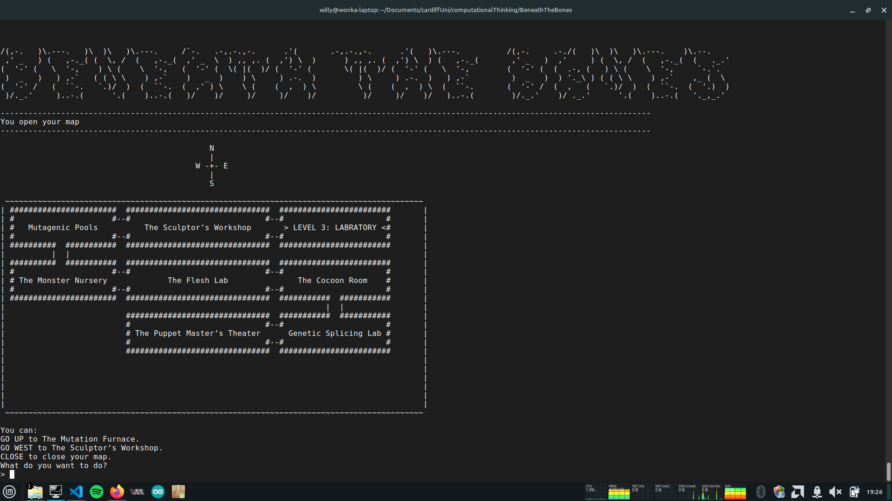
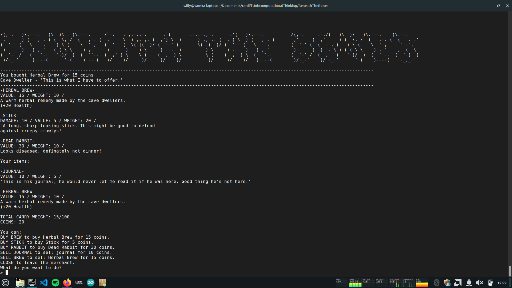
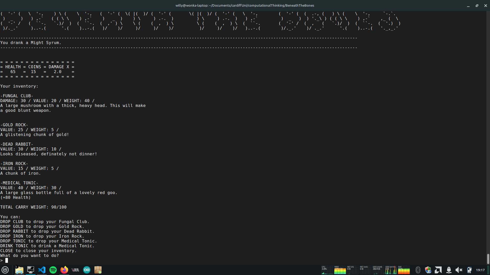
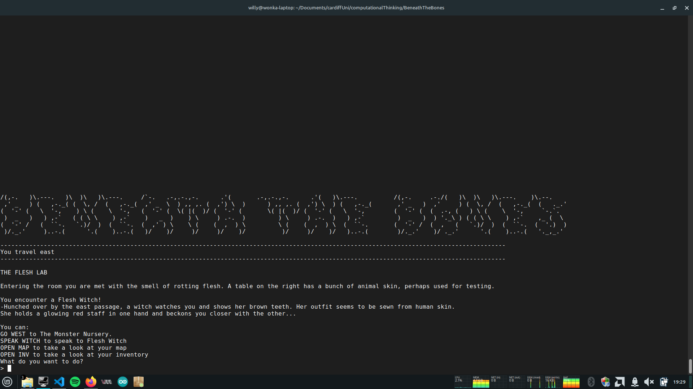

# retro-python-game
This is a fun command-line choose-your-adventure game with combat, bartering and riddles. 

I collaborated with a few classmates (Sean Wheeler, Sonny Normansell, Zainab Ashraf), to create this for a first-year Computational Thinking module at Cardiff University.

The player, Dante, searches for his lost brother Hans in a dark cave,
uncovering sinister secrets along the way. Lab reports reveal experiments within the cave
involving turning animals and people into monsters. Dante battles these mutants, pushing 
through the cave in search of his brother.
    ​

## In this game you will find:

- An entrancing story: join Dante as he discovers the secroets the cave holds.

- Exploration: a full map equipped with many rooms, 3 distinct levels and a variety
of items that serve different purposes.​

- NPCs and bartering: find characters along your journy to speak to and trade items with.

- Combat: a turn-based system that includes various weapons, potions and enemy types.

- Inventory Management: You will come across many items that can be picked up,
dropped and used.

- Adventure: Navigate through rooms, collect items, solve riddles and fight
enemies to progress the levels and see what secrets the cave holds...​

## Simply run game.py to start
